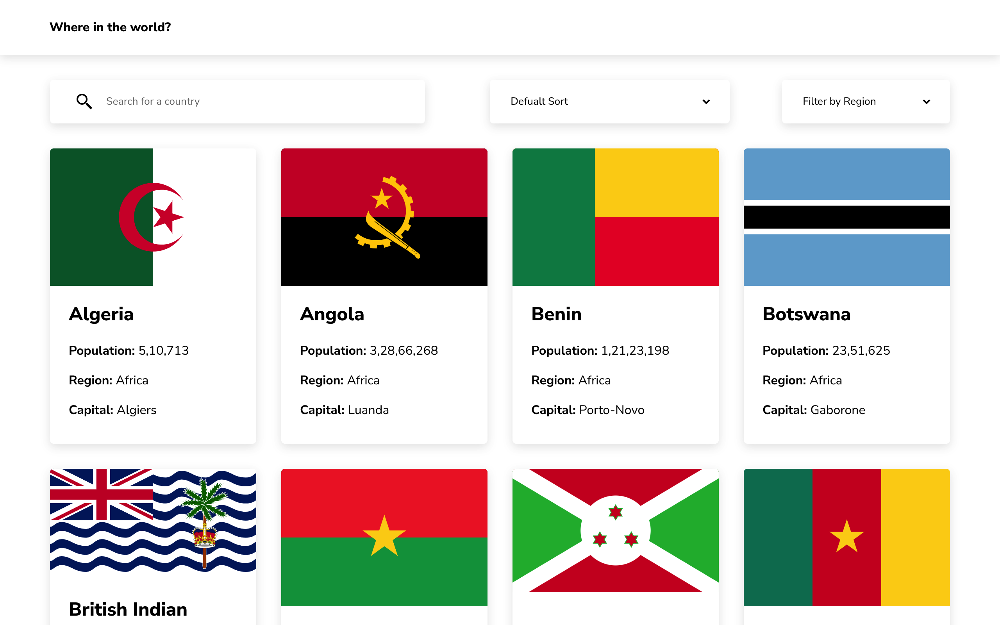

# Frontend Mentor - REST Countries API

This is a solution to the [REST Countries API challenge on Frontend Mentor](https://www.frontendmentor.io/challenges/rest-countries-api-with-color-theme-switcher-5cacc469fec04111f7b848ca). Frontend Mentor challenges help you improve your coding skills by building realistic projects. 

## Table of contents

- [Overview](#overview)
  - [The challenge](#the-challenge)
  - [Screenshot](#screenshot)
  - [Links](#links)
- [My process](#my-process)
  - [Built with](#built-with)
  - [What I learned](#what-i-learned)
  - [Continued development](#continued-development)
  - [Useful resources](#useful-resources)
- [Author](#author)
- [Acknowledgments](#acknowledgments)

## Overview

### The challenge

Users should be able to:

- See all countries from the API on the homepage
- Search for a country using an `input` field
- Filter countries by region
- Click on a country to see more detailed information on a separate page
- Click through to the border countries on the detail page

### Screenshot

### Links

<!-- - Solution URL: [Add solution URL here](https://your-solution-url.com) -->
- Live Site URL: [REST Countries API Challenge Live Site](https://rest-api-countries-abu.netlify.app/)

## My process

### Built with

- Semantic HTML5 markup
- CSS custom properties
- Flexbox
- Mobile-first workflow
- [React](https://beta.reactjs.org/) - JS library
- Fetch & Sort

### What I learned
- How to Fetch data using async and await and promises and how to handle errors
- React Router Dom, Creating and defining Routes.Using Link to enable user to navigate to different pages on the site.
- Pagination: came to learn about how to divide huge data and display them into different pages, so users can navigate between them very easily.
- I came to learn about dangerouslySetInnerHTML(which i have used to replace the country name with  when it's searched)  and why its named the way it has been named and why it's dangerous to use it if there was any user input and no user input should be trusted, it should always be sanitized in client side and as well as on server side.

### Continued development

I wanna understand more about HTTP protocols and status codes and how to use fetch for other http methods like POST, PUT, DELETE, so i can push the data to the server and not just receive the data from the server. I wanna develop projects based on Promise and concepts related to it.

### Useful resources

- [Reactjs Beta Doc](https://beta.reactjs.com) - As of now reactjs documentation is not completed so i have learnt from there beta website which has been very useful lately.

## Author

<!-- - Website - [Add your name here](https://www.your-site.com) -->
- Frontend Mentor - [@Abu-Ubada2020](https://www.frontendmentor.io/profile/Abu-Ubada2020)
- Twitter - [@ab_coding](https://twitter.com/ab_coding)
